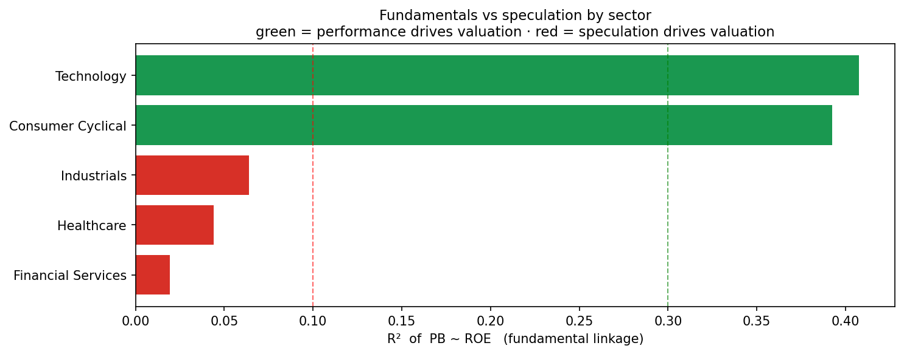
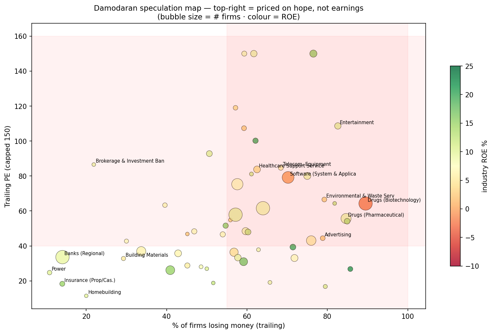

# Fundamentals vs speculation — where valuation tracks performance, and where it doesn't

A company can be expensive for two reasons: it has *earned* the price (high, durable ROE) or
the market is *speculating* on a story. Telling these apart — per sector, per market, over
time — is the difference between value-investing and bag-holding. Three independent lenses,
all pointing the same way.

## 1. The cross-section: PB ~ ROE R² (`fundamentals_vs_speculation.py`)

Residual-income theory: price-to-book should rise with ROE (PB ≈ (ROE−g)/(r−g)). So *within a
sector*, how much of valuation does ROE explain?

- 🟢 **Technology (R² 0.41), Consumer Cyclical (0.39)** — expensive, but disciplined by ROE.
- 🔴 **Healthcare (0.04, median ROE negative), Financials (0.02), Industrials (0.06)** —
  valuation floats free of performance.

## 2. The time dimension: sector drift (`fundamentals_vs_speculation_ts.py`)

The R² is recomputed per year, so you can see *when* a sector decouples from fundamentals:

It flags the real episodes unprompted — **US Healthcare speculative through 2020–21** (the
COVID biotech mania) and **US Technology in 2023–24** (the AI mega-cap run where price left
ROE behind). A collapsing R² is an early warning that a sector is being priced on sentiment.

## 3. The authoritative cross-check: Damodaran (`damodaran_speculation.py`)

Aswath Damodaran's global industry data gives an even sharper signal — the **% of firms
losing money** × **PE** × **PEG**. A sector where most firms lose money yet trades at a high
multiple is *definitionally* priced on hope.

| 🔴 Speculation rules | 🟢 Fundamentals rule |
|---|---|
| Biotech (90% losing, PE 64, ROE −2%) | Insurance (14% losing, PE 18, ROE 15%) |
| Software (70% losing), Entertainment (PE 109) | Banks (Regional), Power |
| Healthcare-IT (PE 507), Pharma (85% losing) | Homebuilding, Building Materials |
| Advertising (PEG 11), Auto&Truck (PEG 12) | Insurance/utilities generally |

Two independent methods — our cross-sectional R² and Damodaran's money-losing×PE — produce
the **same map**. That agreement is the point: it's a real economic regime, not an artifact.

## ⚠️ Crucial refinement: accounting distorts the metrics — not everything low-ROE is speculation

A naive "high PE / low ROE = speculation" reading is unfair to two kinds of sector, because
**accounting shapes the ratios**:

- **Research-heavy sectors** (Biotech R&D/Sales **25%**, Semiconductors **34%**, Software 19%,
  Pharma 22%). R&D is *expensed*, so it (a) depresses current earnings → **understated ROE**,
  and (b) never appears as an asset → **understated book → overstated PB**. These firms are
  *investing* in future value; the market prices the **option value of the R&D pipeline**, not
  current profit. That is a **third regime — "priced on future fundamentals"** — riskier than a
  bank, but *not* baseless speculation. (Damodaran's R&D-capitalisation adjustment barely moves
  biotech ROE, −2.0%→−1.8%, precisely because these firms are genuinely pre-profit — the R&D
  intensity, not the adjustment, is the tell.)
- **Asset-heavy sectors** (utilities, real estate, industrials) carry huge tangible book, which
  **dilutes ROE** and **depresses PB** — so they look "cheap / fundamental" partly by
  construction, and their PB~ROE fit is flattered by book-heavy balance sheets.

So read the map as **three regimes, not two**:

| regime | signature | examples | value-reversion? |
|---|---|---|---|
| 🟢 **Current fundamentals** | ROE > cost of equity, low R&D | banks, insurance, staples | ✅ harvest here |
| 🟡 **Future fundamentals (R&D/growth)** | low ROE **but** high R&D/Sales, reinvesting | biotech, semis, software | ⚠️ priced on pipeline option value — value screens misread it |
| 🔴 **Speculation** | high PE, low ROE, **low** R&D, no reinvestment | some entertainment, meme/story names | ❌ avoid — no fundamental anchor |

The dial that separates 🟡 from 🔴 is **reinvestment (R&D + capex intensity)**: a money-losing
sector pouring 25% of sales into R&D is *building* something; one that isn't is *hoping*.

## Why this matters for the strategy (the payoff)

It is the **same dial as the market-level finding**, one level down. Value-reversion works
where the marginal trader eventually prices on fundamentals:

- **Harvest value-reversion in 🟢 fundamental sectors** (banks, insurance, utilities,
  homebuilding) — cheapness there mean-reverts because price tracks ROE.
- **Avoid it in 🔴 speculation sectors** (biotech, software, entertainment) — cheapness is a
  broken story, not a discount; the multiple won't re-anchor.
- **China** — a retail/speculation-ruled *market* — is precisely where value-reversion failed
  (t 0.04). **Healthcare** is where it would fail *inside* any market. Same physics, two scales.

**Company-level inference:** in a fundamental sector, a stock's distance from the PB~ROE line
is a genuine over/under-valuation signal; in a speculation sector, that distance is noise.

## Data & caveats

- Sector labels: `damodaran_sector_map.parquet` (48k global companies, covers CN 99% / JP 100%
  / US 80% / IN 62%) + yfinance GICS crawl; **KR/EU need a ticker-suffix fix**.
- Cross-section is single-period; survivorship-biased; PB~ROE is a linear proxy for a convex
  link; financials/REITs distort PB with book-heavy balance sheets.
- Damodaran is a global snapshot, mostly US-weighted; % money-losing is trailing.
- The time-series preview is US-only and shallow until the full sector map is joined.

> Descriptive research and education only — not investment advice.
