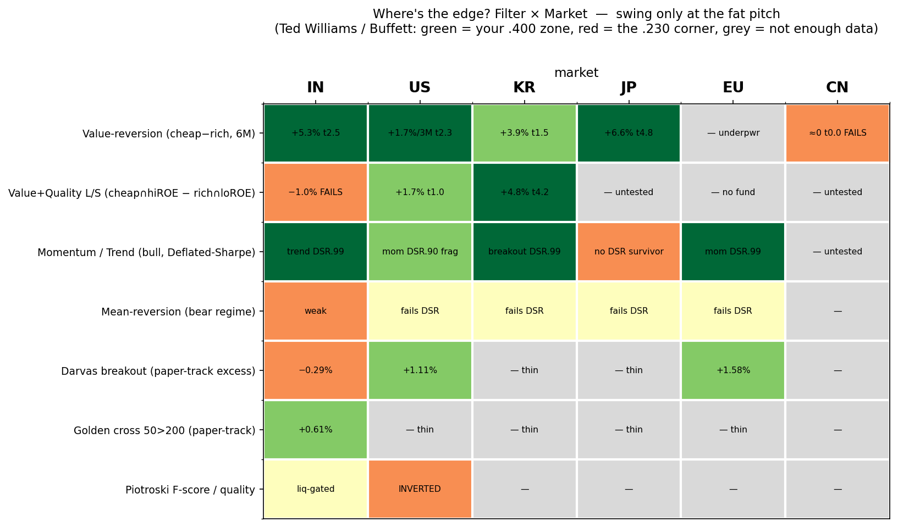

# market-screener-rag

A **credit-free, offline** retrieval + screening tool that runs on the **metrics that
actually work in each market** — the backtested, multiple-testing-survived winning
strategies from a multi-market systematic research platform (India, US, Korea, Japan,
Europe, China). It answers what the winning strategy is per market, reports each
strategy's **historical earnings**, and applies the winning screen to a current-universe
snapshot to produce **stock picks and buy/sell signals**.

No paid API, no model download: rule-based strategy knowledge base + deterministic
screening over bundled ratios + TF-IDF retrieval (scikit-learn). **Numbers come from the
backtests / the data — never invented.**

> 📖 New to the jargon (momentum, PE, t-stat, Deflated Sharpe…)? See **[GLOSSARY.md](GLOSSARY.md)**
> — every term in plain English with everyday analogies, no finance background needed.
>
> ⚠️ **Research and education only — NOT investment advice.** All earnings are gross of
> costs and short-borrow, on survivorship-biased universes; read spreads, not levels.

## Where's the edge? The fat-pitch grid



Ted Williams only swung at pitches in his .400 zone; Buffett borrowed it — *wait for the fat
pitch.* This grid (`edge_matrix.py`) maps every filter/strategy × market to its backtested
edge: 🟩 green = swing (validated edge), 🟥 red = take the pitch (fails), ⬜ grey = not enough
data. The whole platform reduces to two green rows — **value-reversion** (IN/US/KR/JP) and
**momentum** (IN/KR/EU); everything else is grey or red.

> 🔬 **Deeper dive:** [FUNDAMENTALS_VS_SPECULATION.md](FUNDAMENTALS_VS_SPECULATION.md) — which
> sectors price on real performance vs speculation (PB~ROE R², sector drift over time, Damodaran
> global cross-check, and the R&D-heavy / asset-heavy accounting nuance: three regimes, not two).

## The winning strategy per market (backtested, point-in-time)

| market | character | book | winning metric | historical earnings | significance |
|---|---|---|---|---|---|
| **India** | momentum/trend | **long-only** | trend + sector-relative cheapness | value **+5.3%/6M** (≈+10.9%/yr); trend IR 2.34 | t 2.5 · DSR **0.994** ✅ |
| **Korea** | mean-reversion | **full long/short** | cheap∩hi-ROE − expensive∩lo-ROE | **+4.83%/6M** (≈+9.9%/yr) — strongest | t **4.17** · DSR 0.99 ✅ |
| **US** | mixed/light | long-tilt | short-horizon cheap-vs-market | **+1.72%/3M** (≈+6.9%/yr) | t 2.32 ✅ (fades by 6M) |
| **Japan** | value-reversion | long cheap-vs-market | cheap-vs-market (low PE) | **+6.6%/6M** (t 4.84) — deep EDINET | powered ✅ (EDINET-Bench, no key) |
| **Europe** | momentum (bull) | directional | 12-month momentum | IR 1.39 (bull) | DSR 0.985 ✅ · value underpowered |
| **China** | momentum/retail | — | value **tested & fails** | cheap−rich ≈ 0% (t 0.04) — powered null | DSR n/a · value edge absent ✅ tested |

**The universal finding:** momentum/trend (bull regime) is the ONE metric that works in
nearly every market and survives the Deflated-Sharpe multiple-testing correction (India
trend, Korea breakout, Europe momentum). Value-reversion works where powered — strongly in
**India (t 2.5), Korea (t 4.2 L/S), US (t 2.3), and now Japan (t 4.84)** once deep EDINET data
was added — and, tested on 10y data, **fails in China** (the multiple converges but doesn't
reward it: a real null). Japan's flip is the headline lesson: its earlier "underpowered" was a
pure data-DEPTH artifact, not an absence of edge. Every cell is a tested verdict or an explicit
"needs data X" — never an invented number.

## Usage

```bash
pip install -r requirements.txt

python screener_rag.py strategy KR        # winning Korea strategy + its earnings
python screener_rag.py screen IN          # apply the India winning screen -> live picks
python screener_rag.py screen KR          # Korea long/short book
python screener_rag.py earnings           # historical earnings of every strategy
python screener_rag.py universal          # the metric that works in every market
python screener_rag.py ask "why long-only in india"
```

## How it works

- **`winning_strategies.json`** — the knowledge base: per-market character, book, winning
  metrics, screen rules, backtested earnings (t-stats, Deflated-Sharpe), and data-sufficiency
  status. Every figure traces to a point-in-time backtest.
- **`screener_rag.py`** — routes strategy/earnings/universal questions to the KB, applies the
  per-market winning screen to the bundled ratios/clusters to emit live picks (long/short as
  the market's book allows), and answers open questions via TF-IDF retrieval.
- **`data/`** — a bundled snapshot of current fundamentals ratios + peer-valuation clusters
  (regular git objects, not LFS), so the screener runs standalone.

## The overall trading approach (in one paragraph)

We do **not** search for one universal strategy. Each market has a *character* — a dominant
behaviour of prices and multiples — and the job is to (1) identify that character from data,
(2) match it to the factor family that exploits it (momentum/trend where prices trend,
value-reversion where multiples mean-revert, quality where it is repriced), (3) prove the
edge survives multiple-testing and has enough data behind it, and only then (4) turn it into
a long (and, where the character allows, short) book with volatility-scaled sizing. India
trends (long-only momentum + sector-relative value); Korea mean-reverts hard (full long/short
cheap∩hi-ROE vs hollow-overpriced); the US rewards short-horizon value; Europe rewards
momentum; Japan — on deep data — rewards value-reversion strongly; China's multiples converge
but do **not** pay a return premium (a real null). The meta-lesson: **momentum survives almost
everywhere; value works only where the data is deep enough to prove it.**

## Assumptions (stated explicitly, because they bound every number)

1. **Point-in-time (no look-ahead).** Fundamentals are lagged to when they were public —
   `filed` date where available, else fiscal-year-end + 90 days (120 for China's Apr-30
   deadline). A backtest that uses restated or early data manufactures alpha that never
   existed (Harvey & Liu, 2015).
2. **Survivorship bias → read spreads, not levels.** The universes are survivorship-biased
   (dead names drop out). Absolute returns are therefore inflated, but a **cross-sectional
   spread** (Q1−Q5, long−short) largely cancels the market-wide bias, so we only report and
   act on spreads.
3. **Gross of costs.** All earnings are *before* commissions, market impact and short-borrow.
   Net edge must clear the square-root impact cost (Almgren & Chriss, 2000) and, for shorts, a
   locate + borrow fee. A +1.7%/quarter gross spread can be marginal net of costs.
4. **Capacity is small and illiquidity-driven.** The edge concentrates in less-liquid names
   (Amihud, 2002); our own cost/capacity study puts it at **~$300–500k** before decay, dead by
   ~$10M. This is a retail/family-office-scale edge, not an institutional one.
5. **Statistical power via non-overlapping observations.** t-stats are computed on
   *non-overlapping* windows; overlapping monthly formations autocorrelate and inflate
   significance. A 5-year window de-overlapped by 6 months is only ~10 observations — a t-stat
   there is close to meaningless (this is why Japan looked "dead" until deep data arrived).
6. **Coverage bias.** Coverage = |fundamentals ∩ liquid universe| / |liquid universe|. Below
   ~60% the covered names may be a non-random subset, so a result is flagged "returns-only —
   coverage caveat" even when powered.
7. **Sample representativeness.** Some panels are *selected*, not random — e.g. Japan's is the
   Sakana **EDINET-Bench** task-sample (~1,437 firms), so the *magnitude* of the Japan edge may
   be biased even though its *direction and significance* (t 4.84) are decisive.

## How to read the results — quantitatively

| statistic | meaning | bar |
|---|---|---|
| **t-stat** (non-overlap) | is the spread distinguishable from zero? | \|t\| ≳ 2 |
| **Deflated Sharpe Ratio** | is it real after correcting for *how many strategies were tried*? | DSR > 0.95 |
| **non-overlap obs** | is there enough independent data to trust the t-stat? | ≥ 15 → powered |
| **liquid coverage** | is the fundamentals panel representative? | ≥ 60% → complete |

A finding is **trustworthy only when t≳2 AND (for technical factors) DSR>0.95 AND ≥15 obs AND
≥60% coverage.** Fall short on power → "can't conclude" (not "no effect"). Fall short on
coverage only → "returns-only, watch coverage bias." This is why only *three* technical
factors (India-trend DSR 0.994, Korea-breakout 0.99, Europe-momentum 0.985) are treated as
robust while the rest are called fragile.

## How to read the results — qualitatively

- **Character first.** Ask "does this market trend or mean-revert?" before trusting any single
  factor; a factor that wins against the market's character is probably an artifact.
- **Convergence as corroboration.** For value, check the *multiple* itself: do rich PEs fall
  toward the median and cheap PEs rise? If the multiple converges **and** the return spread is
  positive, the effect is real; if the multiple converges but returns don't reward it (China),
  the "value" is a mirage.
- **Nulls and flips are verdicts.** "China value fails" (powered null) and "Japan value works"
  (flip once depth arrived) are both *results*, not gaps. Treat a change in verdict when data
  deepens as information about *power*, not about the world changing.
- **Never trust magnitude on thin/selected samples.** Use the direction and significance;
  discount the headline percentage until coverage is full.

## Literature — the inference methods and where they come from

- **Multiple-testing / backtest overfitting (the Deflated Sharpe Ratio):** Bailey & López de
  Prado (2014), *The Deflated Sharpe Ratio*, J. Portfolio Management; Harvey, Liu & Zhu (2016),
  *…and the Cross-Section of Expected Returns*, RFS; Harvey & Liu (2015), *Backtesting*, JPM.
- **Value / mean-reversion:** De Bondt & Thaler (1985), *Does the Stock Market Overreact?*, JF;
  Lakonishok, Shleifer & Vishny (1994), *Contrarian Investment…*, JF; Fama & French (1992).
- **Momentum / time-series momentum:** Jegadeesh & Titman (1993), JF; Moskowitz, Ooi & Pedersen
  (2012), *Time Series Momentum*, JFE.
- **Quality (F-score):** Piotroski (2000), *Value Investing…*, J. Accounting Research (note: we
  find it **inverted** in the US — a caution that factors don't travel across markets).
- **Execution & market impact:** Almgren & Chriss (2000), *Optimal Execution of Portfolio
  Transactions*; Almgren et al. (2005), square-root impact.
- **Liquidity & capacity:** Amihud (2002), *Illiquidity and Stock Returns*, JFM; Corwin &
  Schultz (2012), high-low spread estimator, JF.
- **Factor selection:** Tibshirani (1996), *Regression Shrinkage and Selection via the Lasso*,
  JRSS-B (used in the learned model, in shadow mode).
- **Market microstructure / HFT context:** Gomber et al., *High-Frequency Trading* (used to
  inform orchestration and cost realism), and the `baobach/hft_papers` reading list.
- **Japanese financial data & the LLM-vs-baseline result:** Sugiura, Ishida, Makino, Tazuke,
  Nakagawa, Nakago & Ha (2025), *EDINET-Bench* (Sakana AI), arXiv:2506.08762 — source of the
  deep Japan panel used here, and independent corroboration that a **naive persistence
  (momentum) baseline is hard to beat**, which matches our universal-momentum finding.

Descriptive research pipeline. Not investment advice. No warranty.
